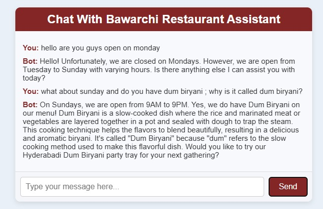

# ChatGPT Restaurant Assistant

**GitHub Repository:** [Restaurant Chatbot](https://github.com/anzarshah/chatbot-restauranthttps://github.com)

 
A conversational AI chatbot designed to assist restaurant customers. Powered by OpenAI's GPT-3.5, the assistant offers a seamless interactive experience, providing menu recommendations and answering common customer queries.

## Key Features
- **Menu Recommendations**:
  - Suggests dishes based on user preferences like vegan or spicy options.
- **Customer Support**:
  - Provides information on restaurant hours, location, and services like party trays.
- **Dynamic Updates**:
  - Reads menu data from a JSON file, allowing real-time updates.
- **Conversational Tone**:
  - Mimics a friendly restaurant assistant for an engaging user experience.

## Tools & Technologies
- **Programming**: Node.js
- **Framework**: Express.js
- **API**: OpenAI GPT-3.5
- **Data Handling**: JSON

## Insights
- Demonstrates the application of conversational AI for enhancing customer service.
- Automates repetitive tasks, saving time for restaurant staff.

## How to Use
- Clone the repository and install dependencies with `npm install`.
- Add your OpenAI API key to a `.env` file.
- Start the server with `npm start` and interact with the chatbot.

---

